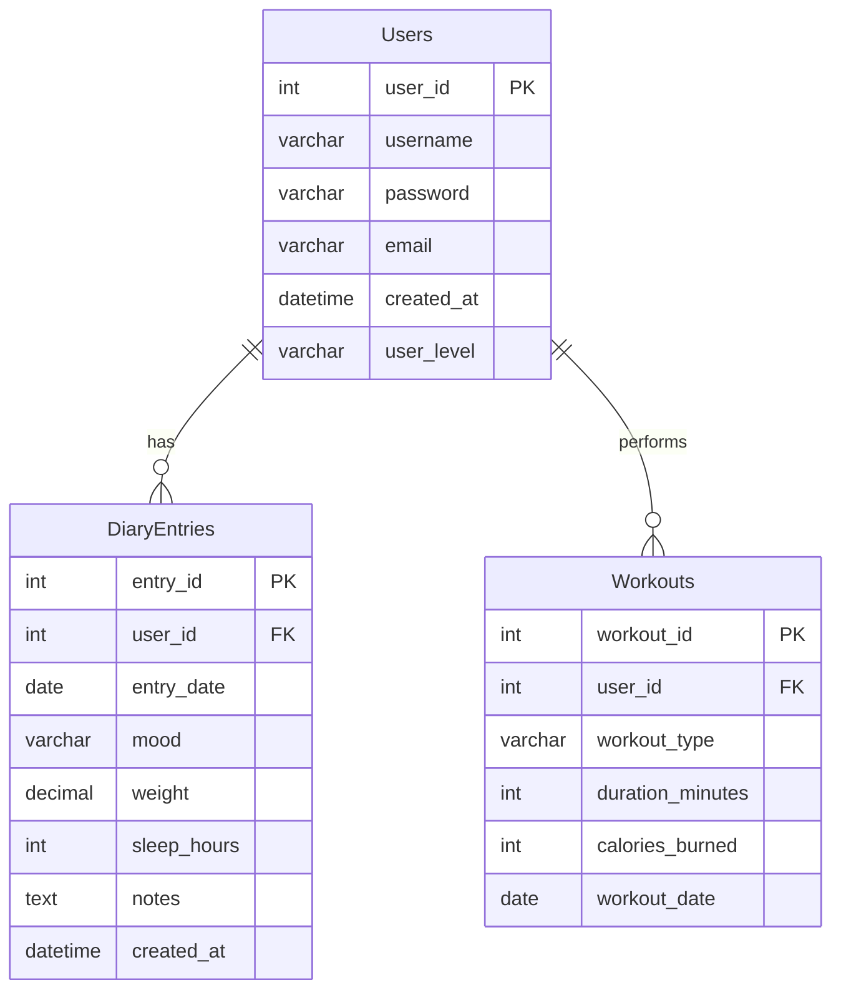

# 🏥 Health Diary – Front-End

Terveysseurantasovelluksen HTML/CSS/JavaScript-käyttöliittymä, joka kommunikoi RESTful-taustapalvelun kanssa.

## 📋 Sovelluksen ominaisuudet

### 🔐 Autentikointi & Käyttäjähallinta
- **Kirjautuminen** – JWT-pohjainen kirjautuminen käyttäjätunnuksella ja salasanalla
- **Uloskirjautuminen** – Session tyhjennys localStoragesta
- **Kirjautumistilan tunnistus** – Automaattinen uudelleenohjaus jos käyttäjä on jo kirjautunut
- **Käyttäjien listaus** – Kaikkien käyttäjien haku ja näyttäminen taulukossa
- **Käyttäjän luonti** – Uuden käyttäjän rekisteröinti (username, email, password)
- **Käyttäjän poistaminen** – Käyttäjän poisto suoraan taulukosta
- **Oman profiilin päivitys** – Suojattu reitti (vain oma tili), JWT-tokenilla

### 📓 Päiväkirjakirjaukset (Entries)
- **Kirjausten haku** – Suojattu reitti, palauttaa vain kirjautuneen käyttäjän kirjaukset
- **Kirjauksen luonti** – Uuden kirjauksen lisääminen (päivämäärä, mieliala, paino, unimäärä, muistiinpanot)
- **Kirjauksen päivitys** – Olemassa olevan kirjauksen muokkaus
- **Kirjauksen poistaminen** – Kirjauksen poisto
- **Kirjausten näyttäminen korteissa** – Responsiivinen card-pohjainen näkymä

### 📦 Kohteet (Items)
- **Kohteiden listaus** – Kaikki kohteet haetaan ja näytetään taulukossa
- **Kohteen haku ID:llä** – Yksittäisen kohteen tietojen haku
- **Kohteen lisääminen** – Uuden kohteen luonti (nimi, paino)
- **Kohteen päivittäminen** – Olemassa olevan kohteen tietojen muokkaus
- **Kohteen poistaminen** – Kohteen poisto vahvistuksen kera
- **Info-dialogi** – Modal-ikkuna kohteen yksityiskohtaisille tiedoille

### ⚖️ BMI-laskin
- Painoindeksin laskeminen pituuden ja painon perusteella
- BMI-kategorian näyttäminen taulukossa korostettuna
- Tekstimuotoinen analyysi tuloksesta

### 🌐 Fetch API Lab
- Erillinen harjoitussivu API-kutsujen testaamiseen

### 🎨 Käyttöliittymä
- Responsiivinen navigaatiopalkki kaikilla sivuilla
- Hero-banneri jokaisella sivulla
- Snackbar-ilmoitukset onnistuneista ja epäonnistuneista toiminnoista
- Yhtenäinen CSS-tyylimäärittely (`src/css/style.css`)

---

## 🗄️ Tietokannan rakenne

Tietokanta suunniteltiin MySQL-yhteensopivaksi. Back-end käyttää tällä hetkellä in-memory -tietorakennetta (taulukot).



### Taulut

| Taulu | Kuvaus |
|-------|--------|
| `Users` | Käyttäjätiedot: käyttäjänimi, salasana (bcrypt-hash), sähköposti, taso |
| `DiaryEntries` | Päiväkirjakirjaukset: päivämäärä, mieliala, paino, unet, muistiinpanot |
| `Workouts` | Treenikirjaukset: tyyppi, kesto, kalorit, päivämäärä |

> **Huom:** Back-end tallentaa datan muistiin (`src/users.js`, `src/entries.js`, `src/items.js`). Palvelimen uudelleenkäynnistys nollaa datan. SQL-skeema löytyy tiedostosta [`db/health_diary.sql`](https://github.com/Basharski/Health-Diary-BE/blob/main/db/health_diary.sql).

---

## 🤖 Robot Framework -testaus

### Tehtävä 1 – Asennetut työkalut

| Työkalu | Versio | Kuvaus |
|---|---|---|
| Robot Framework | 7.4.2 | Testiautomaatiokehys |
| robotframework-browser | 19.12.7 | Web-testaus (Playwright-pohjainen) |
| robotframework-requests | 0.9.7 | REST API -testaus |
| robotframework-crypto | 0.4.2 | Salasanojen kryptaus testeissä |
| robotidy | – | Ei tue Python 3.14 vielä (yhteensopivuusongelma) |

### Vaatimukset

- Python 3.x
- Robot Framework 7.x
- robotframework-browser
- robotframework-requests
- robotframework-crypto

### Asennus

```bash
pip install robotframework
pip install robotframework-browser
pip install robotframework-requests
pip install robotframework-crypto

# Browser Libraryn alustus (lataa Playwright-selaimet)
rfbrowser init
```

> **Huom:** `robotidy` ei tällä hetkellä tue Python 3.14:ää. Asennettavissa kun yhteensopiva versio julkaistaan.

### Tehtävä 2 – Kirjautumistesti (Browser Library)

Tiedosto: [tests/login_tests.robot](tests/login_tests.robot)

Testitapaukset:
| Testitapaus | Kuvaus |
|---|---|
| Successful Login | Kirjautuu oikeilla tunnuksilla (johndoe/password1), tarkistaa ohjauksen merkintäsivulle |
| Failed Login With Wrong Password | Syöttää väärän salasanan, varmistaa että käyttäjä pysyy kirjautumissivulla |
| Login With Empty Fields | Yrittää kirjautua tyhjillä kentillä, tarkistaa HTML5-validoinnin |

**Havainnot:** Browser Library (Playwright-pohjainen) toimii hyvin SPA-sovelluksen kanssa. Testit käyttävät `id=`-selektoreita lomakekenttien paikallistamiseen.

### Tehtävä 3 – Web form -kenttien testaus (Browser Library)

Tiedosto: [tests/webform_tests.robot](tests/webform_tests.robot)

Testisivu: https://www.selenium.dev/selenium/web/web-form.html

Testitapaukset:
| Testitapaus | Kuvaus |
|---|---|
| Dropdown Select | Valitsee vaihtoehdon select-pudotusvalikosta |
| Datalist Input | Kirjoittaa "New York" datalist-kenttään |
| Checkbox Interaction | Poistaa valinnan #1:stä, valitsee #2:n |
| Radio Button Selection | Valitsee toisen radio-napin |
| File Input Verification | Varmistaa että file input -kenttä on olemassa ja oikeanlainen |
| Full Form Submission | Täyttää kaikki kentät ja lähettää, tarkistaa "Received!"-viestin |

**Havainnot:** Browser Library tukee hyvin erilaisia syöttökenttiä. `Select Options By` toimii sekä value- että label-arvoilla. Lomakkeen lähettäminen ja vastauksen tarkistaminen onnistui odotetusti.

### Tehtävä 4 – Päiväkirjamerkinnän luontitesti (RequestsLibrary)

Tiedosto: [tests/entry_tests.robot](tests/entry_tests.robot)

Testitapaukset:
| Testitapaus | Kuvaus |
|---|---|
| Kirjautuminen onnistuu ja palauttaa tokenin | Varmistaa JWT-tokenin saamisen kirjautumisesta |
| Uusi päiväkirjamerkintä luodaan onnistuneesti | Kirjautuu, lähettää POST /api/entries, tarkistaa 201-vastauksen ja entry_id:n |
| Merkinnät haetaan kirjautuneena käyttäjänä | Tarkistaa, että GET /api/entries palauttaa datan autentikoituneelle käyttäjälle |
| Merkinnän luominen ilman tokenia palauttaa 401 | Varmistaa suojauksen: ilman JWT:tä vastaus on 401 Unauthorized |

**Havainnot:** Koska sovelluksen etusivulla ei ole vielä UI-lomaketta merkintöjen luomiseen, testi toteutettiin RequestsLibraryllä suoraan REST API:n kautta. `Login And Get Token` -avainsana (keywords.resource) hoitaa kirjautumisen ja tokenin haun. `POST On Session` -kutsu käyttää tokenin Authorization-headerissa.

### Tehtävä 5 – Kirjautumistesti .env-tiedoston tunnuksilla

Tiedosto: [tests/login_env_tests.robot](tests/login_env_tests.robot)

Testitapaukset:
| Testitapaus | Kuvaus |
|---|---|
| Kirjautuminen onnistuu .env-tiedoston tunnuksilla | Lukee TEST_USERNAME ja TEST_PASSWORD .env:stä, kirjautuu, tarkistaa ohjauksen |
| Kirjautuminen epäonnistuu väärällä .env-salasanalla | Käyttäjänimi .env:stä, mutta väärä salasana estää pääsyn |

**Toteutus:** Tunnukset tallennetaan `.env`-tiedostoon projektin juureen. `resources/variables.py` lataa ne `python-dotenv`-kirjastolla `load_dotenv()`-kutsulla. Robot Framework poimii muuttujat `${TEST_USERNAME}` ja `${TEST_PASSWORD}` automaattisesti Variables-tiedostosta. `.env`-tiedosto on lisätty `.gitignore`:en — oikeita tunnuksia ei julkaista GitHubiin.

**Havainnot:** `python-dotenv` mahdollistaa siistin tavan erottaa konfiguraatio koodista. Muuttujat näkyvät Robot Framework -lokissa arvoinaan (ei kryptattuina) — siksi tehtävä 6 vie turvallisuuden askeleen pidemmälle.

### Tehtävä 6 – Kirjautumistesti kryptatuilla tunnuksilla (CryptoLibrary)

Tiedosto: [tests/login_crypto_tests.robot](tests/login_crypto_tests.robot)

Testitapaukset:
| Testitapaus | Kuvaus |
|---|---|
| Kirjautuminen onnistuu kryptatuilla tunnuksilla | CryptoLibrary purkaa crypt:-muuttujat automaattisesti (variable_decryption=True) |
| Kryptattu salasana ei näy lokeissa | Demonstroi `Input Password` -avainsanan log-maskauksen CryptoLibraryn kanssa |

**Toteutus:**
1. Avainpari generoitiin `CryptoUtility`-kirjastolla: julkinen avain `resources/public_key.key`, yksityinen avain `resources/private_key.json`
2. Tunnukset kryptattiin julkisella avaimella → `crypt:...`-muotoiset arvot tallennettiin testitiedostoon
3. Testiajon aikana `Library CryptoLibrary %{private_key_password} variable_decryption=True` käyttää yksityistä avainta purkamiseen
4. Avainparin salasana asetetaan ympäristömuuttujaksi ennen testiä: `$env:private_key_password="testkey123"`

**Havainnot:** CryptoLibrary käyttää elliptistä käyrä -kryptografiaa (EC). `variable_decryption=True` purkaa kaikki `crypt:`-etuliitteelliset Suite Variables -muuttujat automaattisesti ennen testejä. Yksityinen avain ja `.env`-tiedosto on lisätty `.gitignore`:en — ne eivät päädy GitHubiin.

### Testiprojektin rakenne

```
my-vite-app/
├── tests/
│   ├── api_tests.robot         # API-testitapaukset (Tehtävä 9)
│   ├── entry_tests.robot       # Päiväkirjamerkinnän luontitesti (Tehtävä 4)
│   ├── login_tests.robot       # Kirjautumistestit (Tehtävä 2)
│   ├── login_env_tests.robot   # .env-tunnuksilla kirjautuminen (Tehtävä 5)
│   ├── login_crypto_tests.robot # CryptoLibrary-kirjautuminen (Tehtävä 6)
│   └── webform_tests.robot     # Web form -kenttätestit (Tehtävä 3)
├── resources/
│   ├── keywords.resource       # Yhteiset avainsanat
│   ├── variables.py            # Muuttujat (BASE_URL, FRONTEND_URL, .env-lataus)
│   └── public_key.key          # CryptoLibraryn julkinen avain (gitissä)
├── .env                        # Piilotetut tunnukset – EI GitHubiin (gitignored)
└── results/                    # Testiajot tallentuvat tänne (gitignored)
    ├── output.xml
    ├── log.html
    └── report.html
```

### Testien ajaminen

Varmista ensin, että back-end palvelin on käynnissä osoitteessa `http://127.0.0.1:3000`.

```bash
# Aja kaikki testit ja tallenna tulokset results/-kansioon
robot --outputdir results tests/

# Aja yksittäinen testitiedosto
robot --outputdir results tests/api_tests.robot
robot --outputdir results tests/entry_tests.robot
robot --outputdir results tests/login_env_tests.robot

# Tehtävä 6: aseta yksityisen avaimen salasana ennen ajoa
$env:private_key_password="testkey123"
robot --outputdir results tests/login_crypto_tests.robot
```

Tulokset löytyvät `results/report.html`-tiedostosta selaimella avattavana raporttina.

---

## 📁 Projektirakenne

```
Health-Diary-FE/
├── index.html              # Etusivu
├── fetchtestaus.html       # Fetch API -harjoitussivu
├── src/
│   ├── auth/
│   │   ├── login.html      # Kirjautumissivu
│   │   └── login.js        # Kirjautumislogiikka
│   ├── bmi/
│   │   ├── index.html      # BMI-laskinsivu
│   │   └── bmi.js          # BMI-laskentalogiikka
│   ├── entries/
│   │   └── index.html      # Päiväkirjakirjaukset (kortit)
│   ├── js/
│   │   ├── fetch.js        # Fetch-apufunktiot, token-hallinta, snackbar
│   │   ├── auth.js         # Auth-funktiot (login, logout, me)
│   │   ├── entries.js      # Entries CRUD -funktiot
│   │   ├── items.js        # Items CRUD + UI-logiikka
│   │   ├── users.js        # Users CRUD + UI-logiikka
│   │   └── main.js         # Päämoduuli
│   ├── css/
│   │   └── style.css       # Globaali tyylimäärittely
│   ├── about/              # Tietoa-sivu
│   └── contact/            # Yhteystiedot-sivu
├── public/
├── vite.config.js
└── package.json
```

---

## 🖼️ Kuvakaappaukset sovelluksen näkymistä


### Etusivu


### Kirjautumissivu


### Päiväkirjakirjaukset


### BMI-laskin


---

## 🚀 Asennus ja käynnistys

### Vaatimukset
- Node.js (v18+)
- Back-end palvelin käynnissä (`http://127.0.0.1:3000`)

### Front-end

```bash
npm install
npm run dev
```

### Back-end (erillinen repo)

```bash
# Kloonaa: https://github.com/Basharski/Health-Diary-BE
npm install
npm run dev
```

Palvelin käynnistyy osoitteeseen `http://127.0.0.1:3000`.

### Ympäristömuuttujat

Luo `.env`-tiedosto FE-projektin juureen (valinnainen):

```env
VITE_API_BASE_URL=http://127.0.0.1:3000/api
```

---

## 🔌 API-endpointit (Back-end)

| Metodi | Polku | Suojattu | Kuvaus |
|--------|-------|----------|--------|
| `POST` | `/api/auth/login` | ❌ | Kirjautuminen, palauttaa JWT-tokenin |
| `GET` | `/api/auth/me` | ✅ | Palauttaa kirjautuneen käyttäjän tiedot |
| `GET` | `/api/users` | ❌ | Hakee kaikki käyttäjät |
| `POST` | `/api/users` | ❌ | Luo uuden käyttäjän |
| `PUT` | `/api/users/:id` | ✅ | Päivittää käyttäjän (vain oma) |
| `DELETE` | `/api/users/:id` | ❌ | Poistaa käyttäjän |
| `GET` | `/api/entries` | ✅ | Hakee kirjautuneen käyttäjän kirjaukset |
| `GET` | `/api/entries/:id` | ✅ | Hakee yksittäisen kirjauksen |
| `POST` | `/api/entries` | ✅ | Luo uuden kirjauksen |
| `PUT` | `/api/entries/:id` | ✅ | Päivittää kirjauksen |
| `DELETE` | `/api/entries/:id` | ✅ | Poistaa kirjauksen |
| `GET` | `/api/items` | ❌ | Hakee kaikki kohteet |
| `GET` | `/api/items/:id` | ❌ | Hakee yksittäisen kohteen |
| `POST` | `/api/items` | ❌ | Luo uuden kohteen |
| `PUT` | `/api/items/:id` | ❌ | Päivittää kohteen |
| `DELETE` | `/api/items/:id` | ❌ | Poistaa kohteen |

---

## ⚠️ Tunnetut bugit / ongelmat

- **In-memory data:** Back-end ei käytä pysyvää tietokantaa – palvelimen uudelleenkäynnistys nollaa kaiken datan
- **Items-suojaus:** Items-endpointit eivät vaadi autentikointia (suunniteltu harjoitustarkoituksiin)

---

## 📚 Lähteet, tutoriaalit ja käytetyt teknologiat

### Teknologiat & kirjastot
- [Express.js](https://expressjs.com/) – Back-end web-framework
- [Vite](https://vitejs.dev/) – Front-end build-työkalu
- [express-validator](https://express-validator.github.io/) – Syötteiden validointi
- [jsonwebtoken](https://github.com/auth0/node-jsonwebtoken) – JWT-autentikointi
- [bcrypt](https://github.com/kelektiv/node.bcrypt.js) – Salasanojen hashaus
- [dotenv](https://github.com/motdotla/dotenv) – Ympäristömuuttujat
- [cors](https://github.com/expressjs/cors) – Cross-Origin Resource Sharing

### Oppimislähteet
- [MDN Web Docs – Fetch API](https://developer.mozilla.org/en-US/docs/Web/API/Fetch_API)
- [MDN Web Docs – localStorage](https://developer.mozilla.org/en-US/docs/Web/API/Window/localStorage)
- [MDN Web Docs – ES Modules](https://developer.mozilla.org/en-US/docs/Web/JavaScript/Guide/Modules)
- [JWT.io – JSON Web Tokens](https://jwt.io/)
- [Express.js Documentation](https://expressjs.com/en/guide/routing.html)

### 🤖 Tekoälyn hyödyntäminen
Projektin kehityksessä hyödynnettiin GitHub Copilotia seuraavissa asioissa:
- README.md-tiedoston rakentaminen ja jäsentely
- Koodikommenttien kirjoittaminen
- Virheenkorjausapua fetch-funktioiden kanssa
- Koodin refaktorointiehdotuksia

> Tekoälyn tuottama koodi on tarkastettu ja ymmärretty ennen käyttöönottoa. AI-avusteinen koodi on merkitty kommenteilla lähdekoodissa.

---

## 🧪 Testikäyttäjät

Seuraavat testikäyttäjät löytyvät Back‑endistä (src/users.js):

- **username:** `johndoe` | **password:** `password1`
- **username:** `janedoe` | **password:** `password2`
- **username:** `bobsmith` | **password:** `password3`

---

## 🔗 Linkit

- **Julkaistu sovellus:** https://users.metropolia.fi/~bashara/FE-Web_Sovellu/FE_FINAL/
- **Front-end repo:** https://github.com/Basharski/Health-Diary-FE
- **Back-end repo:** https://github.com/Basharski/Health-Diary-BE